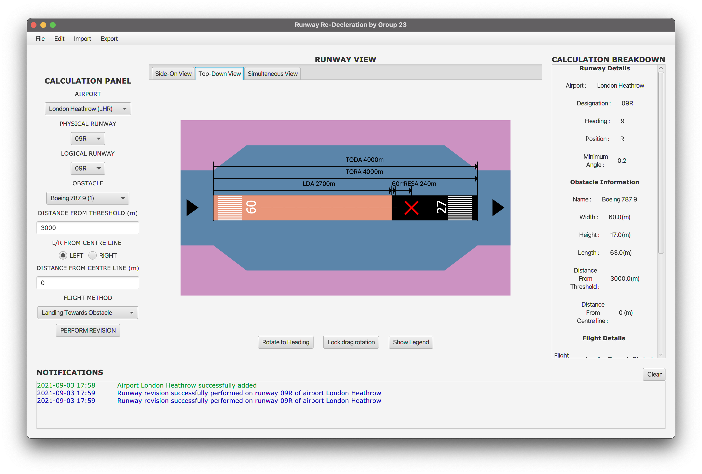
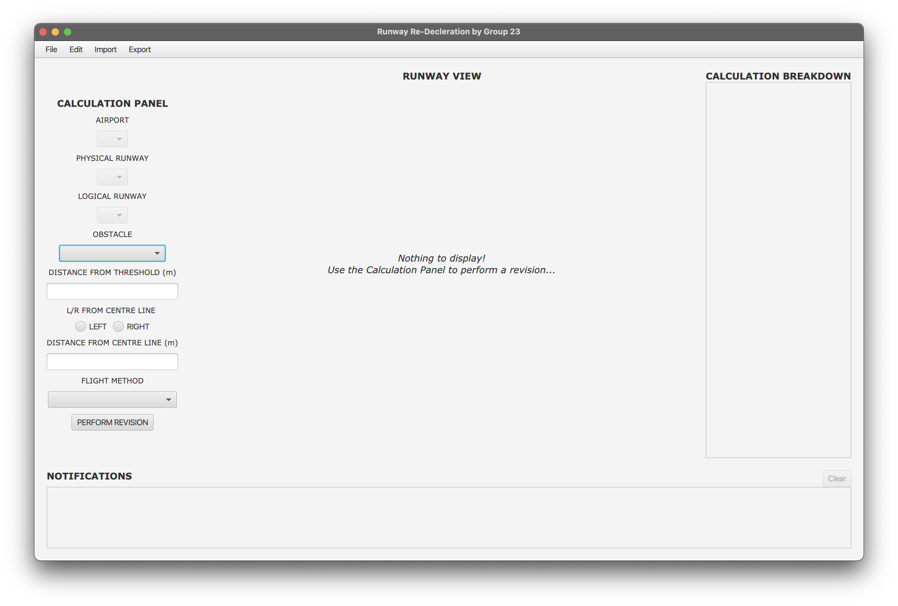
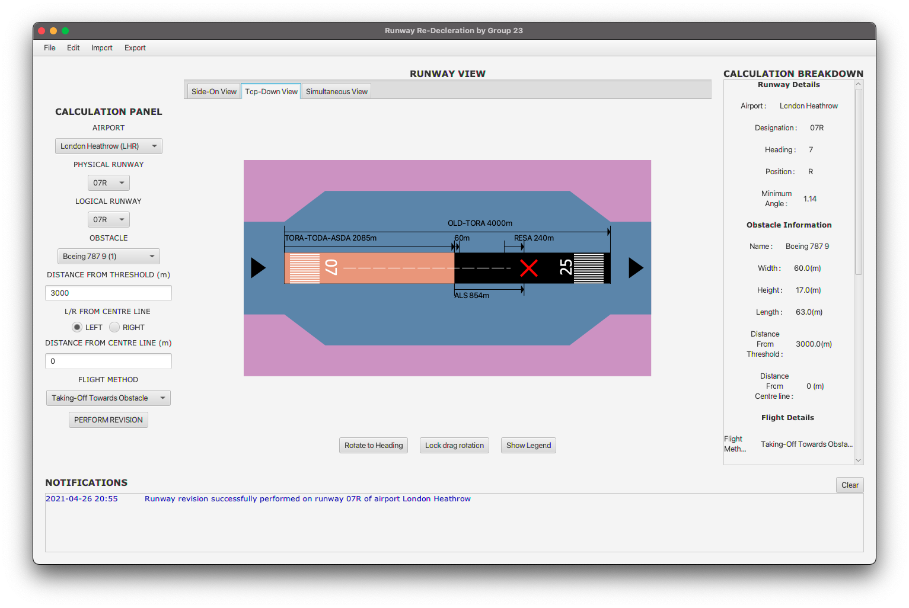

# Runway Re-Decleration Tool

## COMP2211: Software Engineering Group Project

---

## Contents

- **[Introduction](#introduction)**
  * **[Task Description](#task-description)**
  * **[Development Process](#development-process)**
  * **[Repository Contents](#repository-contents)**
- **[Running The Application](#running-the-application)**
- **[Usage](#usage)**

---

## Introduction

### Task Description

- Design and develop a tool that can be used by Airport staff to aid in the re-decleration of a runway in the event of an obstacle/obstruction.

### Development Process

- The development process of this project simulated that of the real-world, with a team of developers working on the system alongside a customer.
- The system (*product*) was developed by a team of six with guidance from a supervisor (*product customer*).
- **Agile Development** was used to build the system in three increments (*sprints*). Value was provided to the customer with each increment and feedback taken on board to adjust the system appropriatley.
- Documentation was written for each increment, which detailed:
  - The **design and development** workings of the sprint - i.e., *what was new to the system*.
  - How the team **responded to the feedback** of the previous sprint - i.e., *how the system was changed*,
  - The team's **plan for the following sprint** - i.e., *what is next for the system*.

### Repository Contents

- Contained in the repository is:
  - A seperate directory for each increment of the development process (`Increment 1`, `Increment 2`, `Increment 3`).
    - Each increment directory contains:
      - `src` : Directory containing the increment's **source code**.
      - `build` : Directory containing the increment's **execcutable**  (as `.jar` files) .
      - `Documentation.pdf` : The **documentation** for the increment.
    - The `Increment 3` directory (final product) also contains:
      - `User Guide.pdf` : A **user guide** which explains how to use the final system and all of it's features
      - `Project Evaluation.pdf` : A **project evaluation report** which details the teams evaluation of the developemnt process.

<p align="center"></p> 

---

## Running The Application

- Each increment contains two `.jar` files,`Windows.jar` and `Mac.jar`, that can be used to run the application on a Windows and MacOS machine respectivley.

- To run either file, navigate to the project directory and use the following command:

  - ```
    java -jar <filename>.jar
    ```

  - Where `filename` is either `Windows` or `Mac` depending on your operating system.

- Alternatively, run either file by **double-clicking** it.

- The application should look like this at open:

<p align="center"></p> 

- <u>*Note*</u>:
  - When run, the system will create a `resources` directory, which is used to store system files and information in order to provide persistence (i.e., data is saved after application close.)

---

## Usage

- Please refer to the demonstration video posted on YoutTube [here](https://www.youtube.com/watch?v=gBGcshrvSaw), or the user guide `Increment 3/User Guide.pdf` for a detailed description on how to use the system and all of its features.

<p align="center"></p> 

---
